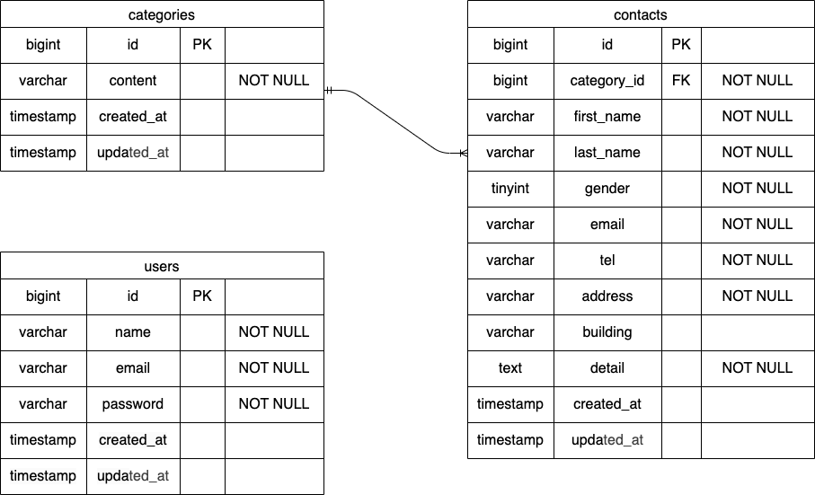

# COACHTECH お問い合わせフォーム（coachtech-contact-form）

COACHTECH 確認テスト：お問い合わせフォームアプリケーションです。  
入力 → 確認 → 送信（DB 保存） → サンクス、管理画面（検索/詳細モーダル/削除/CSV エクスポート）を実装しています。

---

## 環境構築（Docker）

### 1. リポジトリをクローン

```bash
git clone <this repository>
cd coachtech-contact-form
```

### 2. Docker 起動

```bash
docker compose up -d --build
```

### 3. 依存パッケージのインストール（初回は実行してください）

```bash
docker compose exec php bash -lc "cd /var/www && composer install"
```

### 4. 環境変数（.env）

.env が無い場合のみ、以下を実行してください。

```bash
docker compose exec php bash -lc "cd /var/www && cp .env.example .env"
```

※ .env の DB 接続設定は以下を想定しています（Docker 環境のため DB_HOST=mysql）。

```bash
DB_CONNECTION=mysql
DB_HOST=mysql
DB_PORT=3306
DB_DATABASE=coachtech_contact_form
DB_USERNAME=laravel_user
DB_PASSWORD=laravel_pass
```

### 5. APP_KEY 生成（未生成の場合）

```bash
docker compose exec php bash -lc "cd /var/www && php artisan key:generate"
```

### 6. マイグレーション & シーディング（ダミーデータ作成）

```bash
docker compose exec php bash -lc "cd /var/www && php artisan migrate:fresh --seed"
```

### シーディング内容

- categories（Seeder）：5 件
  - 商品のお届けについて
  - 商品の交換について
  - 商品トラブル
  - ショップへのお問い合わせ
  - その他
- contacts（Factory）：35 件

## 使用技術（実行環境）

- PHP（Docker 環境）
- Laravel 8.x
- MySQL 8.0.x
- nginx
- phpMyAdmin
- Laravel Fortify（認証）

## ER 図



## URL

- アプリ（お問い合わせフォーム）：http://localhost/
- 管理画面（要ログイン）：http://localhost/admin
- ログイン：http://localhost/login
- 会員登録：http://localhost/register
- phpMyAdmin：http://localhost:8080/
  - ※ 環境によって表示できない場合があります（Docker のポート公開設定に依存）

## 主な機能

### お問い合わせフォーム

- 入力 → 確認 → 送信（DB 保存） → サンクス
- バリデーション（FormRequest）

### 管理画面（要ログイン）

- 一覧表示（7 件ページネーション）
- 検索（名前/メール/性別/種類/日付）
- 詳細（モーダル表示）
- 削除（モーダル下部の削除ボタン）
- CSV エクスポート（検索条件反映）
